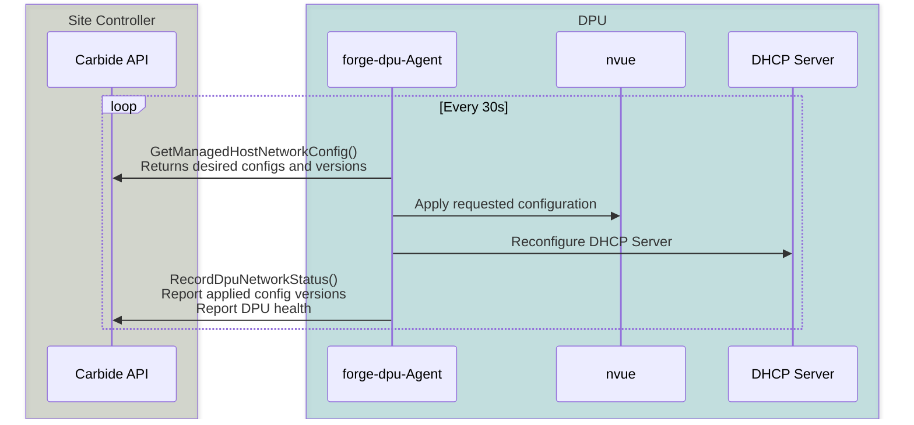
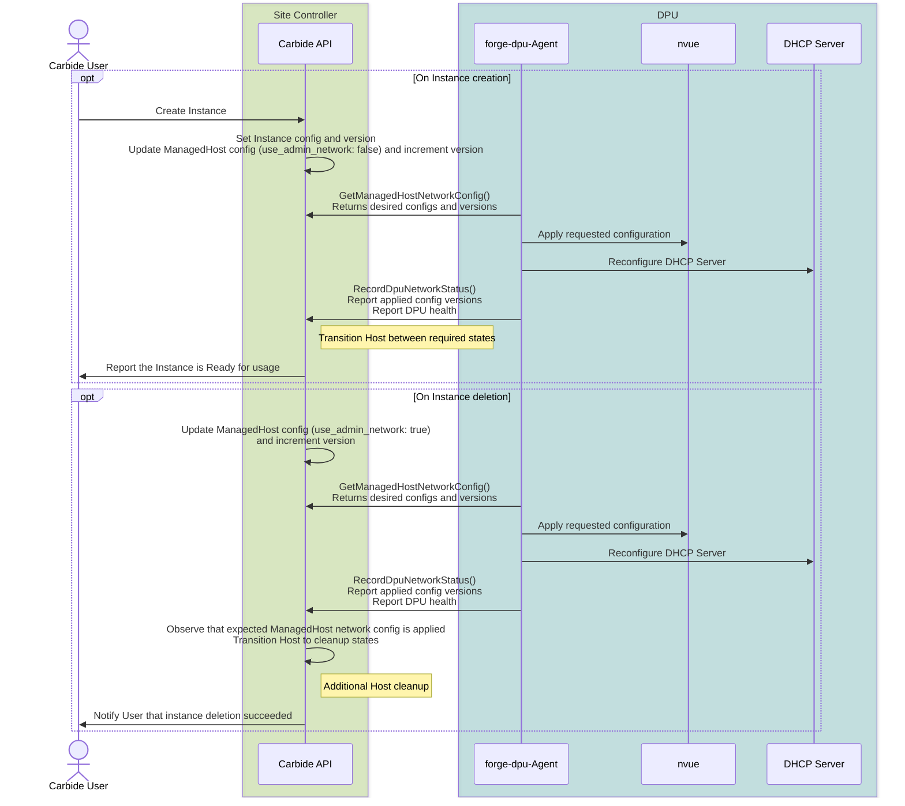

# Carbide DPU configuration

In order to enable virtual private networks (overlay networks) for tenants, Forge utilizes DPUs as primary ethernet interfaces of hosts.

This document describes how Carbide controls DPUs in order to achieve this behavior.

## Guiding principles

- Allow reconfiguration of DPU from any configuration into any other configuration with minimal complexity.
- Provide precise feedback on whether DPUs are configured as required, or whether stale configurations are present on the DPU.
- The DPUs configuration can be reconstructed at any point in time. This is e.g. required after Carbide installs a firmware update and new operating system on the DPU.

## Core configuration flow

The DPUs are configured by the Carbide via a **declarative** and **stateless** mechanism:
- The Carbide agent running on DPUs (`forge-dpu-agent`) request the current desired configuration via the `GetManagedHostNetworkConfig` gRPC API call. Example data of the returned configuration can be seen in the [Appendix](#dpu-configuration-example)
- Every configuration that gets received from Carbide gets converted into a [NVUE](https://docs.nvidia.com/networking-ethernet-software/cumulus-linux/System-Configuration/NVIDIA-User-Experience-NVUE/) configuration file. That configuration file is used to reconfigure HBN via the nvue CLI tool (`nv config apply`).
- `forge-dpu-agent` also reconfigures a DHCP server running on the DPU, which responds to DHCP requests from the attached host.
- After HBN and the DHCP server are reconfigured, `forge-dpu-agent` implements health-checks that supervise whether the desired configurations are in-place and check whether the DPU is healthy. E.g. Carbide continuously checks whether the DPU has established BGP peering with TORs and route servers according to the desired configuration.
- `forge-dpu-agent` uses the `RecordDpuNetworkStatus` gRPC API call to report back to Carbide whether the desired configurations are applied, and whether all health checks are succeeding.
- For the first 30s after any configuration change, the DPU will be reporting itself as unhealthy with a `PostConfigCheckWait` alert. This gives the DPU some time to monitor the stability and health of the new configuration before Carbide assumes that the new configuration is fully applied and operational.



## Configuration versioning

Carbide uses versioned immutable configuration data in order to detect whether any intended changes have not yet been deployed:
- Every time a configuration for the DPU changes, an associated version number is increased.
- The version number is sent back from the DPU to the Carbide as part of the `RecordDpuNetworkStatus`.
- If the reported version number of the DPU does match the last desired version number and if the DPU reports itself as healthy/operational, Carbide knows that the configuration was deployed, and can report that fact to tenants. If the version number does not match the desired version number, or if the DPU is not yet healthy, the Instance will show up as `Provisioning`/`Configuring`/`Terminating` to tenants and administrators.
- **Carbide will never show a configuration as applied without feedback from the DPU. Doing so would cause reliability issues (e.g. double-assignment of IPs) as well as cause security concerns**.

The DPU configuration that is applied can be understood as coming from 2 different sources:
  1. Tenant configurations: While the Host is under control of a tenant, the tenant can change the desired overlay network configuration. The tenant can e.g. control from which VPC prefix an IP address should be allocated for a given network interface. They can also decide how many Virtual Function interfaces (VFs) are utilized, and what their configuration is.
  2. Carbide and Host lifecycle: During the lifecycle of a Host, certain parts of the network configuration need to be updated. E.g. when the Host is provisioned for a tenant, the Host networking gets reconfigured from using the admin overlay network towards the tenant overlay network. When the Host is released by the tenant, it is moved back onto the admin network.

In order to separate these concerns, Carbide internally uses 2 different configuration data structs and associated version numbers (`instance_network_config` vs `managedhost_network_config`). It can thereby distinguish whether a setting that is required by the tenant has not been applied, compared to whether a setting that is required by the control plane has not been applied.

Some example workflows which lead to updating configurations are shown in the following diagram:



## Host isolation

One important requirement for Carbide is that Hosts/DPUs that are not confirmed to be part of the site are isolated from the remaining hosts on the site.

A DPU might get isolated from the cluster without the DPU software stack being erased - e.g. by Carbide site operators removing the knowledge of the DPU from the site database.

In order to satisfy the isolation requirements and to prevent unknown DPUs on the site to use resources (e.g. IPs on overlay networks), an additional mechanism is implemented:
If the `GetManagedHostNetworkConfig` gRPC API call returns a `NotFound` error, the dpu-agent will configure the DPU/Host into an isolated mode.
The isolated configuration is only applied when the site controller is unaware about the DPU and its expected configuration. In case of any other errors (e.g. intermittent communication issues), the DPU retains its last known configuration.

*Note: This is not the only mechanism that Carbide utilizes to provide security on the networking layer. In addition to this, ACLs and routing table separation are used to implement secure virtual private networks (VPCs).*

## Appendix

### DPU configuration example

```json
{
  "asn": 4294967000,
  "dhcp_servers": [
    "10.217.126.2"
  ],
  "vni_device": "vxlan48",
  "managed_host_config": {
    "loopback_ip": "10.217.96.36",
    "quarantine_state": null
  },
  "managed_host_config_version": "V3-T1733950583707475",
  "use_admin_network": false,
  "admin_interface": {
    "function_type": 0,
    "vlan_id": 14,
    "vni": 0,
    "gateway": "10.217.97.1/24",
    "ip": "10.217.97.49",
    "interface_prefix": "10.217.97.49/32",
    "virtual_function_id": null,
    "vpc_prefixes": [],
    "prefix": "10.217.97.0/24",
    "fqdn": "10-217-97-49.dev3.frg.nvidia.com",
    "booturl": null,
    "vpc_vni": 0,
    "svi_ip": null,
    "tenant_vrf_loopback_ip": null,
    "is_l2_segment": true,
    "vpc_peer_prefixes": [],
    "vpc_peer_vnis": [],
    "network_security_group": null
  },
  "tenant_interfaces": [
    {
      "function_type": 0,
      "vlan_id": 16,
      "vni": 1025032,
      "gateway": "10.217.98.1/26",
      "ip": "10.217.98.11",
      "interface_prefix": "10.217.98.11/32",
      "virtual_function_id": null,
      "vpc_prefixes": [
        "10.217.98.0/26"
      ],
      "prefix": "10.217.98.0/26",
      "fqdn": "10-217-98-11.unknowndomain",
      "booturl": null,
      "vpc_vni": 42,
      "svi_ip": null,
      "tenant_vrf_loopback_ip": null,
      "is_l2_segment": true,
      "vpc_peer_prefixes": [],
      "vpc_peer_vnis": [],
      "network_security_group": null
    }
  ],
  "instance_network_config_version": "V1-T1733950572461281",
  "instance_id": {
    "value": "b4c38910-9319-4bee-ac04-10cabb569a4c"
  },
  "network_virtualization_type": 2,
  "vpc_vni": 42,
  "route_servers": [
    "10.217.126.5",
    "10.217.126.11",
    "10.217.126.12"
  ],
  "remote_id": "c3046v74fnh6n4fs5kqvha0t76ub7ug7r9eh1dtilj0pe89eh99g",
  "deprecated_deny_prefixes": [
    "10.217.4.128/26",
    "10.217.98.0/24",
    "172.16.205.0/24"
  ],
  "dpu_network_pinger_type": "OobNetBind",
  "deny_prefixes": [],
  "site_fabric_prefixes": [
    "10.217.4.128/26",
    "10.217.98.0/24",
    "172.16.205.0/24"
  ],
  "vpc_isolation_behavior": 2,
  "stateful_acls_enabled": false,
  "enable_dhcp": true,
  "host_interface_id": "3912c59c-8fc0-400d-b05f-7bf62405018f",
  "min_dpu_functioning_links": null,
  "is_primary_dpu": true,
  "multidpu_enabled": false,
  "internet_l3_vni": null
}
```
